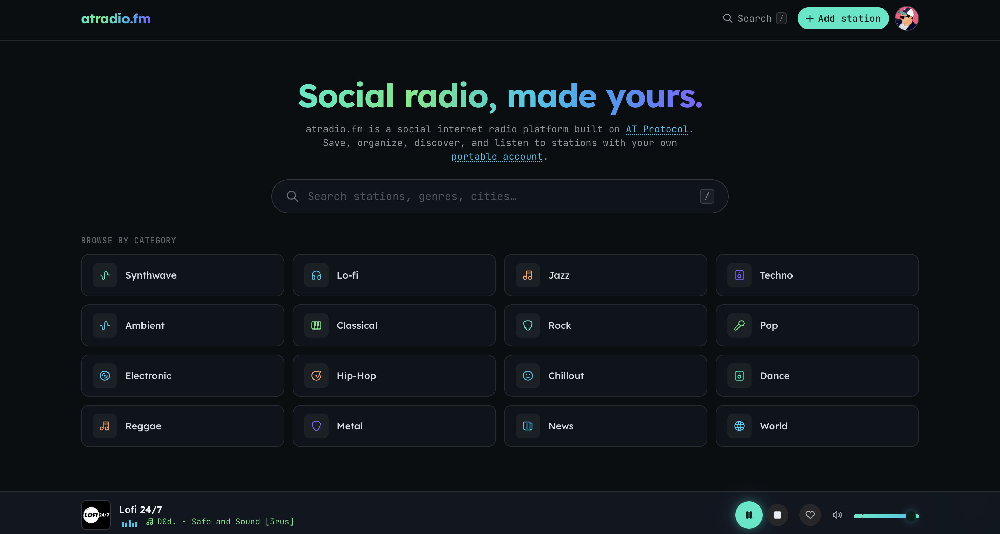

# atradio.fm

[](https://discord.gg/WA9hq9Tmkz)

A **social internet radio platform built on the AT Protocol**. Search stations
from [radio-browser.info](https://www.radio-browser.info/) and TuneIn, stream
them in the browser, and save favorites + your own stations to **your own PDS**
(portable, user-owned data). Installable as a PWA.



## Architecture

```
                 OAuth + reads/writes (in the browser, via atcute)
   apps/web (React SPA) ───────────────────────────────► your PDS (source of truth)
        │  reads other users' profiles                        │  fm.atradio.* records
        ▼                                                     │  (firehose)
   apps/api  ◄── XRPC (/xrpc/fm.atradio.*) ── discovery       ▼
   Express + Drizzle + Postgres  ◄── Jetstream consumer ◄── Jetstream (×4 hosts)
   (the AppView / index)
```

- **Auth + your own data** are 100% client-side (`@atcute/oauth-browser-client`).
  Favorites/stations are written straight to your PDS as `fm.atradio.*` records —
  no auth server.
- **apps/api** is a read-only **AppView**: a Jetstream consumer indexes those
  records into Postgres, and XRPC endpoints serve them (for public profiles and
  discovery). It also hosts the production TuneIn + ICY media proxies.

## Monorepo layout

```
atradio.fm/
├─ apps/
│  ├─ web/            # Vite + React SPA (player, search, OAuth, gating, profiles)
│  └─ api/            # Express + Drizzle + Postgres: Jetstream consumer, XRPC, proxies
├─ packages/
│  └─ lexicons/       # fm.atradio.* lexicons (authored in Pkl → JSON) + TS/zod/mappers
├─ tools/
│  └─ console/        # Babashka + Clojure + rebel REPL command hub
├─ systemd/           # deployment units (api + jetstream)
├─ console            # ./console → launches the command REPL
└─ turbo.json / mise.toml / package.json (bun workspaces)
```

## Stack

- **Monorepo:** Turborepo + Bun workspaces; toolchain pinned via `mise`
- **Web:** React 19, Vite, Tailwind v4, HeroUI v3, TanStack Router/Query, Jotai, Vitest
- **AT Proto:** `@atcute/*` (browser OAuth, client, identity-resolver, tid)
- **API:** Express, Drizzle ORM, Postgres, `ws` (Jetstream), Zod, consola
- **Lexicons:** Apple **Pkl** → lexicon JSON (`pkl eval`)
- **Console:** Babashka + Clojure + rebel-readline

## Getting started

```bash
mise install        # node, bun, java, clojure, babashka
bun install
bun dev             # turbo: web (:3000) + api (:8080)
```

Set up the database (Postgres; TLS required):

```bash
cd apps/api
cp .env.example .env      # set DATABASE_URL, PORT
bun run db:generate       # generate migration from the Drizzle schema
bun run db:migrate        # apply it
```

## Command console

```bash
./console           # Clojure + rebel REPL: (dev) (build) (migrate) (gen-lexicons) …
# or from tools/console:
bb tasks            # the same commands as Babashka tasks
```

## AT Protocol

- **Login** is browser OAuth (atcute public client). Dev uses the `127.0.0.1`
  loopback client — **open the app at `http://127.0.0.1:3000`** (not `localhost`).
  Prod uses the static `apps/web/public/client-metadata.json`.
- **Gating:** favoriting, adding, and removing stations require login (they open
  the login modal). Browsing, search, and playback stay public.
- **Lexicons** (`packages/lexicons`, NSID `fm.atradio.*`): `station`, `favorite`,
  and the `getFavorites` / `getStations` queries. Authored in **Pkl**:
  ```bash
  cd packages/lexicons && bun run pkl:gen   # pkl/defs/**.pkl → lexicons/**.json
  ```
- **Data:** your favorites/stations are records in your PDS (read on login,
  written with optimistic UI). Any user's profile is viewable at
  `/profile/:did` or `/profile/:handle`.

## Backend (apps/api)

- **Jetstream consumer** connects to **all four** official instances
  simultaneously (`jetstream{1,2}.us-{east,west}.bsky.network`) for redundancy,
  filtering `fm.atradio.favorite` / `fm.atradio.station`, and upserts into
  Postgres (`users`, `favorites`, `stations`) with a resumable cursor. Duplicate
  events across hosts are harmless (idempotent upserts keyed by record `uri`).
- **XRPC** (open CORS, read-only): `fm.atradio.getFavorites`,
  `fm.atradio.getStations` (`?actor=<did|handle>&limit&cursor`), plus
  `getRecentStations` / `getPopularStations` for discovery.
- **Media proxies:** `GET /api/tunein/*` (TuneIn CORS) and `GET /api/icy?url=…`
  (ICY "now playing"). The web app points `VITE_TUNEIN_PROXY` / `VITE_ICY_PROXY`
  at the deployed API in prod; in dev it uses Vite's built-in proxy.

## Deployment

- Static-host `apps/web/dist/` (includes the PWA service worker + client-metadata).
- Run the API via the `systemd/` units (`atradio-api` + `atradio-jetstream`) — see
  `systemd/README.md`.

## Keyboard shortcuts

| Key           | Action                     |
| ------------- | -------------------------- |
| `/`           | Open search palette        |
| `Space` / `K` | Play / pause               |
| `M`           | Mute / unmute              |
| `F`           | Favorite (requires login)  |
| `A`           | Add station (requires login) |
| `↑` / `↓`     | Volume up / down           |
| `?`           | Shortcuts overlay          |
| `Esc`         | Close dialogs              |

## Notes

- Use **`bun run test`**, not `bun test` (the latter runs Bun's built-in runner).
- ICY "now playing" is best-effort — many stations expose no metadata.
