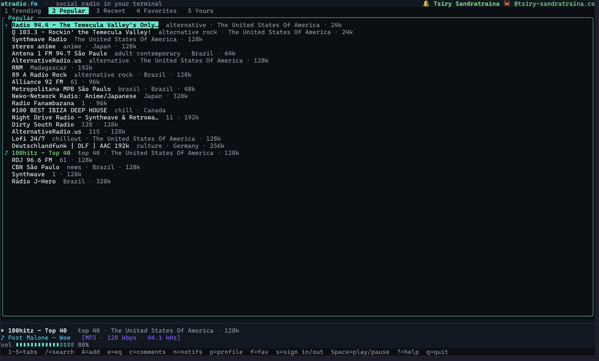

# atradio

[](https://github.com/tsirysndr/atradio.fm/actions/workflows/nix.yml)
[](https://discord.gg/WA9hq9Tmkz)

`atradio.fm` in your terminal — a TUI radio player on the AT Protocol.

A native Rust client for [atradio.fm](https://atradio.fm): browse trending /
popular / recently-played stations, fuzzy-search the whole radio-browser
directory, play live streams with a full Rockbox DSP/equalizer chain, and —
when signed in — favorite stations, add your own, and post comments to your PDS.



## Contents

- [Install](#install)
- [Build (from a checkout)](#build-from-a-checkout)
- [Usage](#usage)
- [Signing in](#signing-in)
- [Keybindings (TUI)](#keybindings-tui)
- [Equalizer & DSP](#equalizer--dsp)
- [atradio Connect (remote control)](#atradio-connect-remote-control)
- [Platform notes](#platform-notes)
- [Lexicon bindings](#lexicon-bindings)

## Install

Prebuilt release tarballs, `.deb`, and `.rpm` packages are attached to every
[GitHub release](https://github.com/tsirysndr/atradio.fm/releases), named
`atradio-<version>-<os>-<arch>.tar.gz` (`macos-amd64`, `macos-aarch64`,
`linux-amd64`, `linux-aarch64`, `freebsd-amd64`, `freebsd-aarch64`,
`netbsd-amd64`, `netbsd-aarch64`) — each contains the binary, README, and
LICENSE. The BSD builds run in emulated VMs and are attached to the release
shortly after it's published (aarch64 ones can take hours).

### macOS / Linux — Homebrew

```bash
brew install tsirysndr/tap/atradio
```

### Linux — Debian / Ubuntu

Direct `.deb`:

```bash
# amd64
curl -LO https://github.com/tsirysndr/atradio.fm/releases/latest/download/atradio_0.1.0_amd64.deb
sudo apt install ./atradio_0.1.0_amd64.deb

# arm64 (Raspberry Pi 4/5, Apple-silicon VM, …)
curl -LO https://github.com/tsirysndr/atradio.fm/releases/latest/download/atradio_0.1.0_arm64.deb
sudo apt install ./atradio_0.1.0_arm64.deb
```

Or via the Gemfury apt repo (auto-updates with `apt upgrade`):

```bash
echo "deb [trusted=yes] https://apt.fury.io/tsiry/ /" \
  | sudo tee /etc/apt/sources.list.d/tsiry.list
sudo apt update && sudo apt install atradio
```

### Linux — Fedora / RHEL / openSUSE

Direct `.rpm`:

```bash
sudo dnf install \
  https://github.com/tsirysndr/atradio.fm/releases/latest/download/atradio-0.1.0-1.x86_64.rpm
```

Or via the Gemfury dnf/yum repo:

```bash
sudo tee /etc/yum.repos.d/tsiry.repo <<'EOF'
[tsiry]
name=tsiry
baseurl=https://yum.fury.io/tsiry/
enabled=1
gpgcheck=0
EOF
sudo dnf install atradio
```

### Nix

```bash
# Optional: use the binary cache to skip building.
cachix use atradio

# One-off run:
nix run github:tsirysndr/atradio.fm

# Install into your user profile:
nix profile install github:tsirysndr/atradio.fm

# Dev shell (rust toolchain + build deps):
nix develop github:tsirysndr/atradio.fm
```

### From source (Cargo)

```bash
# Runtime/build deps: a C toolchain (for the Rockbox codecs) + ALSA on Linux.
sudo apt-get install -y build-essential pkg-config libasound2-dev   # Debian/Ubuntu

cargo install --git https://github.com/tsirysndr/atradio.fm --bin atradio
```

## Build (from a checkout)

```bash
cd cli
cargo build --release
./target/release/atradio          # launch the TUI
```

Building compiles the vendored Rockbox codecs, so a C toolchain is required
(clang/gcc). macOS uses CoreAudio; Linux needs ALSA dev headers
(`libasound2-dev`).

> **License note:** this crate links `rockbox-playback` (GPL-2.0-or-later), so
> the compiled `atradio` binary is GPL-2.0-or-later.

## Usage

```bash
atradio                       # interactive TUI (default)
atradio --no-tui              # headless Connect device (remote-controllable)
atradio search lofi           # search radio-browser, print results
atradio play "jazz"           # headless: play the top hit for a query…
atradio play https://…/stream #   …or a stream URL directly
atradio trending              # trending stations from the AppView
atradio login                 # sign in with an app password (env), or:
atradio login --oauth         # sign in via the browser (OAuth)
atradio whoami                # show the signed-in account
atradio logout
```

## Signing in

Reads to the AppView are public; **favoriting, commenting, adding stations,
appearing in recently-played, and [atradio Connect](#atradio-connect-remote-control)
require a session.** Two ways to authenticate:

- **App password** — set env vars, then `atradio login`:
  ```bash
  export ATPROTO_IDENTIFIER="you.bsky.social"
  export ATPROTO_APP_PASSWORD="xxxx-xxxx-xxxx-xxxx"
  ```
- **OAuth** — `atradio login --oauth you.bsky.social`, or press `s` in the TUI
  to open the sign-in modal, which completes the flow in your browser.

The session + a small profile cache are stored under `~/.config/atradio/`
(also `settings.toml` for volume + DSP).

## Keybindings (TUI)

| Key             | Action                                                   |
| --------------- | -------------------------------------------------------- |
| `↑`/`↓` `j`/`k` | move selection                                           |
| `←`/`→` `Tab`   | switch home tab                                          |
| `1` … `5`       | tabs: Trending / Popular / Recent / Favorites / Yours    |
| `Enter`         | play the selected station                                |
| `Space`         | play / pause · `m` mute · `+`/`-` volume (or adjust DSP) |
| `/`             | fuzzy station search                                     |
| `f`             | favorite the selected/current station                   |
| `A`             | add a custom station (when signed in)                    |
| `c` / `a`       | comments / add a comment                                 |
| `d`             | Connect: pick a device to play/control (see below)       |
| `n`             | notifications                                            |
| `p`             | your profile (with playable recently-played)             |
| `e`             | equalizer & DSP settings                                 |
| `s`             | sign in (OAuth) / sign out                               |
| `h` · `?`       | home · help                                              |
| `q` / `Esc`     | quit / close overlay                                     |

## Equalizer & DSP

Press `e` for the full Rockbox chain: a 10-band equalizer, bass/treble tone,
crossfeed, perceptual bass, Haas surround, a compressor, and channel mode /
stereo width. Changes apply live and persist to `settings.toml`. DSP stays
**local** — the native EQ bands (32 Hz–16 kHz) differ from the web build's, so
they are not synced to your PDS.

## atradio Connect (remote control)

Like Spotify Connect: when signed in, every atradio client you have open — this
CLI, the web app, other terminals — shows up as a **device** on your account,
and any of them can control the selected player. Requires a session (it's keyed
to your DID and authenticated with an atproto service-auth token); logged-out
clients don't participate.

- Press **`d`** to open the device picker. Pick **This device** to play here, or
  pick another device to **control it from here** — pressing `Enter` on a station,
  `Space`, `m`, and `+`/`-` are then sent to that device instead of your local
  audio. The player bar shows a `◉ Controlling <device>` indicator with the
  remote's now-playing and volume.
- Selecting a device **transfers** playback to it (Spotify-style): what you're
  playing follows you to the device you pick; picking **This device** pulls it
  back and stops the remote.
- Your **listening status** (`fm.atradio.actor.status`) is now driven by Connect:
  it's cleared automatically once none of your devices are playing.

### Headless daemon (`--no-tui`)

```bash
atradio --no-tui              # stay online as a controllable device; Ctrl-C to stop
```

Runs with no TUI — just an online player you drive from the web app or another
client (great for a Raspberry Pi or a always-on box wired to your speakers).

The device name shown to your other clients defaults to a hostname-based label;
set a custom one in `~/.config/atradio/settings.toml`:

```toml
device_name = "Living Room"
```

## Platform notes

- **Linux:** the player is exposed over **MPRIS** (D-Bus), so media keys and
  desktop panels / `playerctl` can see now-playing and drive play/pause/stop.

## Lexicon bindings

The typed `fm.atradio.*` records/queries in `src/fm_atradio/` and
`src/builder_types.rs` are **generated** from the lexicon JSON in
`packages/lexicons/lexicons/atradio` via jacquard's codegen. Regenerate with:

```bash
cargo install jacquard-lexgen   # provides `jacquard-codegen`
bash scripts/gen-lexicons.sh
```
